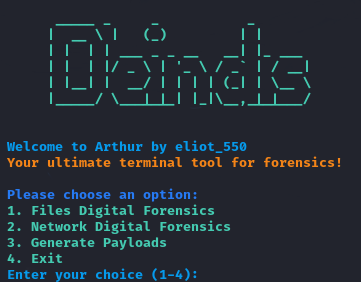

# Arthur - Digital Forensics Tool

Arthur is a powerful and versatile terminal-based tool for digital forensics, designed to assist with network and file analysis. Whether you're a cybersecurity professional or a forensic investigator, Arthur offers easy-to-use options for capturing network traffic, analyzing packets, and performing file integrity checks.

---

## 🚀 Features

- **File Digital Forensics**: Extract file metadata, check file integrity with hashing, and more.
- **Network Digital Forensics**: Capture and analyze network packets, explore network traffic, and more.
- **Reverse Shell**: Includes an option to open a reverse shell to the victim's device (for educational use in controlled environments).
  
## 🖼️ Preview



## 📂 Installation

To run Arthur, follow these steps:

1. **Clone the repository**:
    ```bash
    https://github.com/ELIOT-550/Arthur.git
    ```

2. **Navigate to the project directory**:
    ```bash
    cd arthur
    ```

3. **Make the script executable**:
    ```bash
    chmod +x arthur.sh
    ```

4. **Run the script**:
    ```bash
    ./arthur.sh
    ```

## ⚙️ Usage

Once you run the script, you'll be presented with a menu that allows you to choose between different forensics options:

### 1. Files Digital Forensics
- **Extract File Metadata**: View file details such as size, creation time, and access time.
- **Check File Integrity**: Calculate SHA-256 hashes to verify file integrity.

### 2. Network Digital Forensics
- **Capture Network Packets**: Capture packets using `tcpdump` or `Bettercap`.
- **Analyze Network Traffic**: Analyze network traffic in real-time.

### 3. Reverse Shell (Educational Purposes)
- Open a reverse shell to the victim's device. (Note: Use in controlled, ethical environments only.)

---

## 🔧 Requirements

- **Linux-based OS** (Ubuntu, Kali Linux, Debian, etc.)
- **tcpdump** or **Bettercap** for network packet capture
- **root permissions** for network packet capture
- **bash shell** to execute the script

---


## 🙌 Contributing

Contributions are welcome! If you'd like to improve Arthur, fork the repo and submit a pull request. Please make sure to follow the code of conduct and keep your contributions respectful.

1. Fork the repository
2. Create your feature branch (`git checkout -b feature-name`)
3. Commit your changes (`git commit -am 'Add new feature'`)
4. Push to the branch (`git push origin feature-name`)
5. Create a new Pull Request

---

- **Author**: eliot_550
- **Thanks_to**: Denios Arthur
- **GitHub**: [https://github.com/ELIOT-550]
